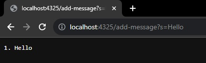
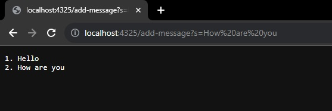

# Lab Report 2

## Part 1
### Code for StringServer

```
import java.io.IOException;
import java.net.URI;

class Handler implements URLHandler {
    // The one bit of state on the server: a number that will be manipulated by
    // various requests.
    String Output = "";
    int num = 0;
    public String handleRequest(URI url) 
    {
        if(url.getPath().equals("/"))
        {
            return String.format("Nothing to be found!");
        }  
        else 
        {
            if(url.getPath().contains("/add-message"))
            {
                String[] parameters = url.getQuery().split("=");
                if(parameters[0].equals("s"))
                {
                    num++;
                    Output += ((num) + ". " + parameters[1] + "\n");
                    return Output;
                }
            }
            return "404 Not Found!";
        }
    }
}

class StringServer {
    public static void main(String[] args) throws IOException {
        if(args.length == 0){
            System.out.println("Missing port number! Try any number between 1024 to 49151");
            return;
        }

        int port = Integer.parseInt(args[0]);

        Server.start(port, new Handler());
    }
}
```
### Description of Screenshots

1. `/add-message` Tested Using `Hello` as Query
   
    

    -The main method that was called was `handleRequest(URI url)`, it takes in the
     entire url as an argument and passes it through checks to see what was inputted
    -Inside the `url` argument there are parameters, it first checks if it contains
     `/add-message`, if it detects that, it checks for a following `?s=` and it checks for
     a string after the `=` sign, since `Hello` was placed after the equal sign, it becomes
     `parameters[1]` and it is taken into the method as part of the `url` argument
    -The only value that gets modified in the `handleRequest` method is the varaible declared
     as `String Output = ""`, the string taken in from the argument `url` in the form of
     `parameters[1]` is concatenated to `Output`, which becomes `1. Hello` as a result of the line
     `Output += ((num) + ". " + parameters[1] + "\n");`

3. `/add-message` Tested Using `How are You` as Query

    

    -The main method that was called was `handleRequest(URI url)`, it takes in the
     entire url as an argument and passes it th rough checks ot see what was inputted
    -Inside the `url` argument there are paramters, it first checks if it contains
     `/add-message`, if it detects that, it checks for a following `s=` and it checks for
     a string after the `=` sign, since `How are you` was placed after the equal sign, it becomes
     `parameters[1]` and it is taken into the method as part of the `url` argument
    -The only value that gets modified in the `handleRequest` method is the variable declared
     as `String Output = "1. Hello`, the string taken in from the argument `url` in the form of
     `parameters[1]` is concatenated to `Output`, which becomes `1. Hello` followed by a new line
     then `2. How are You` as a result of `Output += ((num) + ". " + parameters[1] + "\n");`
   
   
