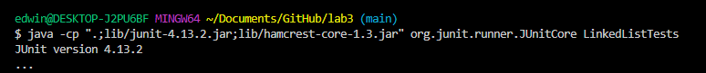

# Lab Report 3

## Part 1: Bugs
### Failure Inducing Input for LinkedList

```
    @Test
    public void testEmpty2()
    {
        LinkedList list1 = new LinkedList();
        list1.append(1);
        list1.append(2);
        list1.append(3);
        assertEquals(3,list1.length());
    }
```
This produced a failure-inudcing output as it was
supposed to check if the LinkedList was a size of "3"
but instead, there is no output and the loop never ends

### Non-Failure Inducing Input for LinkedList

```
    @Test
    public void testAdd() 
    {
        LinkedList list1 = new LinkedList();
        list1.append(1);
        assertEquals(1, list1.first());
        assertEquals(1, list1.last());
    }
```
This did not induce a failure on LinkedList as it added an element with value
"1" to the LinkedList, and it was tested for by using the `first` and `last`
function calls where it checks for the first and last element of the linked list,
and due to the fact that there is only one element in the LinkedList, it returns as 
"1" for both instances

### Symptom of Failure



While it does not specifically state that it has an infinite loop, the program never
stops running and needs to be stopped with a system interrupt.

### Bug Before and After

Before
```
while(n.next != null)
{
n = n.next;
n.next = new Node(value, null);
}
```

After
```
 while(n.next != null) 
{
n = n.next;
}
n.next = new Node(value, null);
```
The faulty code was actually hidden away in the append function where values are added to the end of the list,
the failure inducing input would not happen until adding more than two values; when a third value was added to the
LinkedList, it would go to the `Before` code block and attempt to add it that way, but what was wrong is that the code
`n.next = new Node(value, null);` was inside the while loop, so `n.next` would keep on getting the value that was to be 
appended only once, therefore `n.next` would never truly be `null` as it would keep receiving that same value again and
again. To fix this, `n.next = new Node(value, null);` was moved out of the while loop and the while loop could correctly
loop throughout the entire linked list, and set the next null node to the value that is to be appended. This fixes it 
because it stops the infinite looping by allowing the value to be appended only once and allows the final next node to be
null.

## Part 2: Researching Commands

### Researching "less" command
1. `less -E` , less will exit as soon as it reaches the end of the file / when it sees the end of file flag
   ```
   edwin@DESKTOP-J2PU6BF MINGW64 ~/Documents/GitHub/docsearch/technical/911report (main)
   $ less -E chapter-1.txt
   edwin@DESKTOP-J2PU6BF MINGW64 ~/Documents/GitHub/docsearch/technical/911report (main)
   $ less -E preface.txt
   ```
   While I can't show the entire text file when using `less -E`, I can describe it. using `less -E` in either
   scenario like the ones shown in the code block above will show the text file given as an argument. The text file
   can be scrolled through using the up and down arrow keys, but with the `-E` in `less`, once it reaches the end of the
   file, the file automatically closes and returns to the terminal that doesn't show the file contents
  
2. `less -f` , less forces non regular files because sometimes less does not want to open certain types of files
   ```
   edwin@DESKTOP-J2PU6BF MINGW64 ~/Documents/GitHub/docsearch/technical/911report (main)
   $ less -f chapter-1.txt
   edwin@DESKTOP-J2PU6BF MINGW64 ~/Documents/GitHub/docsearch/technical/911report (main)
   $ less -f preface.txt
   ```
   Again, While I can't show the entire text file when using `less -f`, it can be described. In this case, `-f` on `less`
   allows non regular files to be opened. Less is usually opened with text files, but you can open files such as binary
   files with `less` if used with the `-f` specifier. 
   
3. `less - F`, less will exit if the entire file can be displayed on one screen
   ```
   edwin@DESKTOP-J2PU6BF MINGW64 ~/Documents/GitHub/docsearch/technical/911report (main)
   $ less -F chapter-1.txt
   edwin@DESKTOP-J2PU6BF MINGW64 ~/Documents/GitHub/docsearch/technical/911report (main)
   $ less -F preface.txt
   ```
   Since the files and directories in `./technical` are much too large to be displayed on one screen. The `-F` specifier
   does not concern the files in `./technical`, however, if a file could be displayed on one screen, things that come with
   `less` such as scrolling with arrows will not be able to be used as the entire file could be displayed on one page.
   
4. `less - N`, less will display line numbers for each line
   ```
   edwin@DESKTOP-J2PU6BF MINGW64 ~/Documents/GitHub/docsearch/technical/911report (main)
   $ less -N chapter-1.txt
   edwin@DESKTOP-J2PU6BF MINGW64 ~/Documents/GitHub/docsearch/technical/911report (main)
   $ less -N preface.txt
   ```
   ```
      1
      2
      3
      4             PREFACE
      5             We present the narrative of this report and the recommendations that flow from it to
   ```
   A snippet from the preface.txt file, less starts with its normal way of operation by being able to scroll through the file
   and only showing a small part of a file at first. However, because it's showing the beginning, we can see the start of the file
   indicated with line number 1 and counting down the file.

All information was derived from https://man7.org/linux/man-pages/man1/less.1.html , and anything else not stated on that page was
information through observation when running the command.
   


