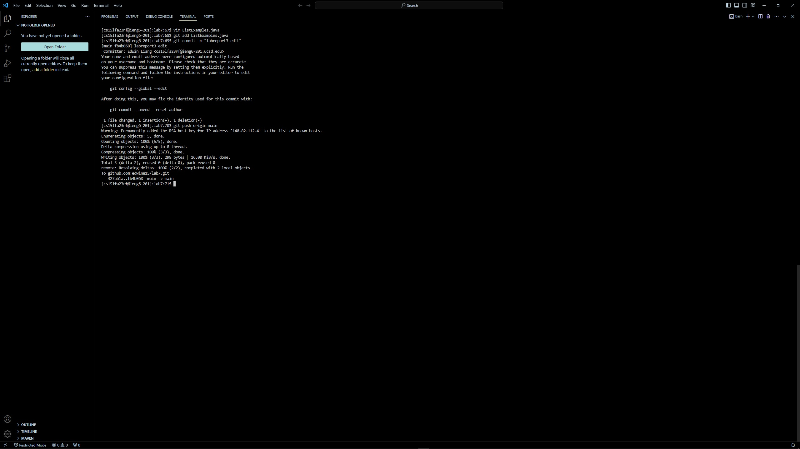

# Lab Report 4

## Step 4

```
Keys Pressed: <up><enter>
```
Right before I started doing the steps, I ssh'ed into ieng6 so by pressing <up> to go back a single command in the bash history
and <enter> to run that previous command, I was able to ssh back into the server with just two key presses.

## Step 5

```
Keys Pressed: git clone <alt tab><click><ctrl c><ctrl v><enter> 
```
Right after I ssh'ed into ieng6, I had to clone the repository that was forked by typing `git clone` and the ssh url provided
by github. Since this was the first time I had done that on this specific computer, I had to type out `git clone`, but since 
the url was on my clipboard, instead of typing out the url after `git clone` I just pressed `Ctrl + V`

## Step 6

```
Keys Pressed: cd lab7 <alt tab><click><ctrl c><ctrl v><enter>, <alt tab><click><ctrl c><ctrl v>ListExamplesTests<enter>
```
While I forgot to screenshot it, I had typed `cd lab7` to change my current working directory to the `lab7` directory so I 
could run the java compliation and run commands. I did this by copy and pasting the provided java commands given, with the 
first copy paste and run with: `javac -cp .:lib/hamcrest-core-1.3.jar:lib/junit-4.13.2.jar *.java` and the second command with
`java -cp .:lib/hamcrest-core-1.3.jar:lib/junit-4.13.2.jar org.junit.runner.JUnitCore` and typing out `ListExamplesTests` so I
could run compilation on the `.java` files and the test file by giving the second command the argument `ListExamplesTests`

## Step 7

```
Keys Pressed: vim L<tab> .<tab> <enter> ?index1 ce index2 <esc> :wq
```
`vim` is first typed out to specify that I want to open a file in vim, and in the argument section of `vim`, I type in `L<tab>`
because the only files in the `lab7` directory that start with `L` are `ListExamples.java` and `ListExamplesTests.java`, so 
by pressing tab, bash autocompletes up to `ListExamples` and by typing out `.<tab>`, bash sees `ListExamples.` and since the 
only file that matches `ListExamples.` is `ListExamples.java` it autocompletes to `ListExamples.java`, then enter opens 
`ListExamples.java` in the vim text editor. The full command typed at first was `?index1 ce index2`, where `?index1` first
gives a backwards search from the bottom of the file for the first occurance of `index1` which is the one to replace, `ce` 
clears the word the cursor is on so `index1` is deleted and once `index1` is deleted, just typing out `index2` allows it to 
take the previous spot of `index1`, `esc` is then pressed to exit out of insert mode and back into normal mode, once in normal
mode typing `:wq` allows the file to save the file and exit out of vim editing and back to the bash terminal

## Step 8

```
Keys Pressed: <up><up><up><enter> <up><up><up><enter>
```
Since the `javac` and `java` commands were in the bash history, I press the up arrow three times to reach the 
`javac -cp .:lib/hamcrest-core-1.3.jar:lib/junit-4.13.2.jar *.java` command, and press enter to run it, then by pressing 
the up arrow three times again, I get to the `java -cp .:lib/hamcrest-core-1.3.jar:lib/junit-4.13.2.jar org.junit.runner.JUnitCore` in the bash history and press enter to run it, and the output shows up as no error unlike on 
step 6

## Step 9

```
Keys Pressed: git add L<tab> .<tab> git commit -m "labreport3 edit" git push origin main
```
After fixing the `ListExamples.java` file, `git add` is used in combination with the sequence from earlier consisting of
`L<tab> .<tab>` to get the result of `git add ListResults.java`, after running that to save changes to be comitted, 
`git commit -m "labreport3 edit"` is typed out with the `git commit` to start the statement to commit the files of the
cloned directory, then with the option `-m` a messaged is specified along with the commit where I used `"labreport3 edit`
and the full statement comes out to `git commit -m "labreport3 edit`. After the two commands, `git push origin main` is 
called to push the changes that were made by add and saved by commit to my personal forked repository.

