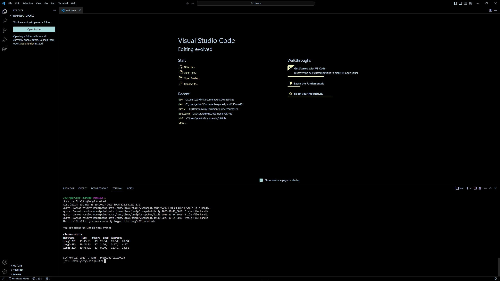

#Lab Report 4

## Step 4

```
Keys Pressed: <up><enter>
```
Right before I started doing the steps, I ssh'ed into ieng6 so by pressing <up> to go back a single command in the bash history
and <enter> to run that previous command, I was able to ssh back into the server with just two key presses.

## Step 5

Right after I ssh'ed into ieng6, I had to clone the repository that was forked by typing `git clone` and the ssh url provided
by github. Since this was the first time I had done that on this specific computer, I had to type out `git clone`, but since 
the url was on my clipboard, instead of typing out the url after `git clone` I just pressed `Ctrl + V`

## Step 6

While I forgot to screenshot it, I had typed `cd lab7` to change my current working directory to the `lab7` directory so I could
run the java compliation and run commands. I did this by copy and pasting the provided
