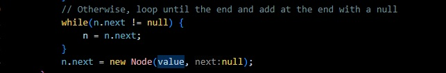

# Lab Report 5

# Part 1: Debugging Scenario

### Original Student Post

I ran my code with two JUnit tests and it infinite loops. I have to use a system interrupt in order to stop the code.
When I run the code with the singular JUnit test of testing if the LinkedList is empty, it runs perfectly fine. However,
when I try to add the second JUnit test of adding adding another item, it decides to infinite loop. I have while loops
inside the the add methods, but they should stop when it sees a null node as the next one; where could the error be?

### TA Response
It seems like you know where the error lies. You know that it's in the add method because it only fails in that JUnit
test where you call the add method; and you also know its in a while loop. Knowing that; try to draw or visualize how
the while loop would function when calling that add method and what checks that loop is making in order to keep running
or what would cause it to stop. Make sure the varialbes you decide to update inside the while loop are the correct ones you
want to update, and are the correct values you want to assign to those variables. 

### Student Response to TA

I found the error. In my add statement, there is a a loop for adding to the linkedList when is more than one element in 
the list. I had mistakenly had it so everytime the while loop ran, the statement `n.next = new Node(value, null);` would
execute as it was inside the loop, and a new node would be created with the value to be added, and the check `n.next != null`
would never return false, and the loop would continously run.

