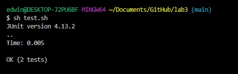

# Lab Report 5

# Part 1: Debugging Scenario

### Original Student Post


I ran my code with two JUnit tests and it infinite loops. I have to use a system interrupt in order to stop the code.
When I run the code with the singular JUnit test of testing if the LinkedList is empty, it runs perfectly fine. However,
when I try to add the second JUnit test of adding adding another item, it decides to infinite loop. I have while loops
inside the the add methods, but they should stop when it sees a null node as the next one; where could the error be?

### TA Response
It seems like you know where the error lies. You know that it's in the add method because it only fails in that JUnit
test where you call the add method; and you also know its in a while loop. Knowing that; try to draw or visualize how
the while loop would function when calling that add method and what checks that loop is making in order to keep running
or what would cause it to stop. Make sure the varialbes you decide to update inside the while loop are the correct ones you
want to update, and are the correct values you want to assign to those variables. 

### Student Response to TA



I found the error. In my add statement, there is a a loop for adding to the linkedList when is more than one element in 
the list. I had mistakenly had it so everytime the while loop ran, the statement `n.next = new Node(value, null);` would
execute as it was inside the loop, and a new node would be created with the value to be added, and the check `n.next != null`
would never return false, and the loop would continously run.

### Bug Info
There were three files inside a directory called `lab3` that were used. The files were given in a previous lab and contained
the files `LinkedListExample.java` `LinkedListTests.java` and the `test.sh` bash script was created by me. In the `LinkedListExample.java`
file it contained all general working functions of a linked list; a node, adding a node, returning the first and last element,
the length etc. The main focus was in the `append(int value)` function where it would add to the end of the list, in that 
function, there is a problem with the part of the function that allows it to loop through to the end of a linked list and add
a new value there. This is where the JUnit tests from `LinkedListTests.java` come in, there is a JUnit test in `LinkedListTests.java` 
where it adds 6 values to the linked list, so it ends up calling every part of the add function at some point. However, after 
using `sh test.sh` with the `test.sh` bash script which contain the necessary commands for `javac` and `java` to compile and run the files,
the JUnit test runs into an infinite loop because of an error in the add statement. This is seen in the code as:
```
        while(n.next != null) {
            n = n.next;
            n.next = new Node(value, null);
        }
        return;
```
The error is that the `n.next = new Node(value, null);` statement needs to be outside of the loop to createa new node after 
reaching the end of the while loop; if it stays inside the while loop as it is currently; the loop will keep creating new 
nodes with valid values and `n.next` will never be null and therefore the loop will never end, to fix this, the statement is
moved outside:
```
        while(n.next != null) {
            n = n.next;
        }
        n.next = new Node(value, null);
        return;
```
When the statement is moved outside, the loop correctly loops from the front of the linked list to the end of the linked list, 
and then and only then is a new node created with the value that is to be added.

# Part 2: Reflection
I appreciate the consistent use of bash scripting, github, and sometimes vim. I think especially with things such as bash 
and github where in the future I would expect to work in a unix enviroment and use things like github for version control 
when working with teams. On vim, the search functions that I learned actually became useful when I was doing programming
assignments for CSE30 and it saved some time when trying to locate certain variables or where functions were called. I think
it was very useful to get started with using things such as bash, github, and vim, because even though it is still 
relatively new material to me, having enough info to get started is very useful for the future. 
